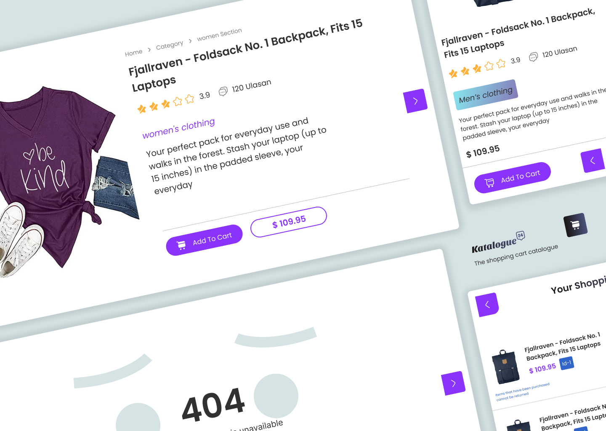

;

# Build Katalogue APPs

Katalogue-app is a platform for a collection of electronics, clothing, jewelry product, etc.

 

 

---

## Creadits

- APP : [Katalogue App](https://katalogue-app.web.app/)
- API Public : [Fakestoreapi](https://fakestoreapi.com/docs)
- See Design Katalogue APP : [Design Katalogue App](ttps://www.figma.com/community/file/1257129954134861095)

---

## Tech Stack

 
 
 

